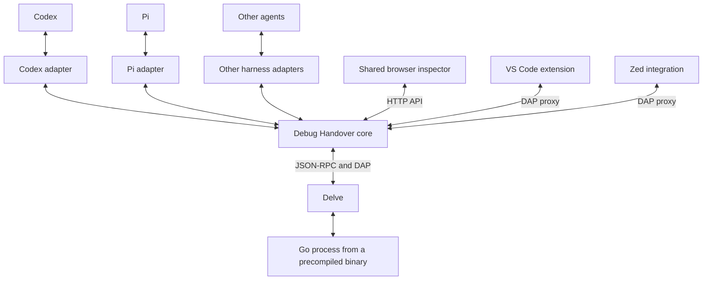

# Architecture

The goal is one persistent debugger session that an agent and a human can pass back and forth. Starting a session uses an existing Go executable or test binary; a handover preserves the process, memory, breakpoints, and stopped location.

## Proposed cross-agent structure

- **Core:** manages sessions, debugger operations, ownership, stale-action checks, persisted state, handover events, and recovery.
- **Harness adapter:** exposes tools to its agent, binds the correct conversation, opens the shared inspector, and delivers handover events. Each harness can add a small native widget without duplicating the debugger UI.
- **Shared inspector:** displays source, stack, goroutines, locals, watches, breakpoints, and ownership. The proposed adapter contract supplies the agent's display name and return destination.
- **Editor integration:** attaches to the same Delve process through the broker and supports returning control to the agent. VS Code has a companion extension; Zed currently uses a generated profile and Codex desktop automation to select it.

Observers may inspect the session, but only the current owner may control execution. Handover requires a settled pause. An event returning control to an agent must be checked against current ownership and its destination before the agent reads fresh state. Waking a conversation does not authorize resuming the target.

## Implemented today

The Go broker has a standalone JSON CLI, an authenticated local HTTP API, a Delve JSON-RPC client, and a DAP ownership proxy. The TypeScript browser inspector and VS Code companion share that session. Codex handback delivery uses `codex queue --thread`; Zed attachment uses a generated debug profile.

The code is still one Go package, with Codex-specific owner labels and notification routing. The diagram describes the intended adapter boundary, not an already extracted interface. Pi and an MCP server are not implemented.

| Component | Current source |
| --- | --- |
| CLI and session descriptor | `main.go`, `scripts/debug-handover` |
| HTTP API and ownership | `broker.go`, `editor.go` |
| Delve inspection and execution | `rpc.go`, `inspect.go` |
| Editor protocol proxy | `dap.go` |
| Persistence, recovery, diagnostics | `lifecycle.go` |
| Codex event delivery and skill | `notification.go`, `skills/debug-handover/` |
| Browser inspector | `web/` |
| VS Code companion | `vscode/` |
| Zed profiles | `zed.go` |

## Next boundary to extract

Replace the fixed Codex identity and destination with a harness binding, and keep durable handover events in the core. The Codex adapter would preserve the current queue behavior. A Pi adapter could register debugging tools, open the same inspector, and deliver handbacks to the matching Pi session. Recovery must account for an agent being offline, conversation switching or forking, and stale or duplicate events.

The repository is named `delve-llm-adapter`. Existing `debug-handover` plugin, CLI, extension, and session identifiers remain stable during this extraction.
