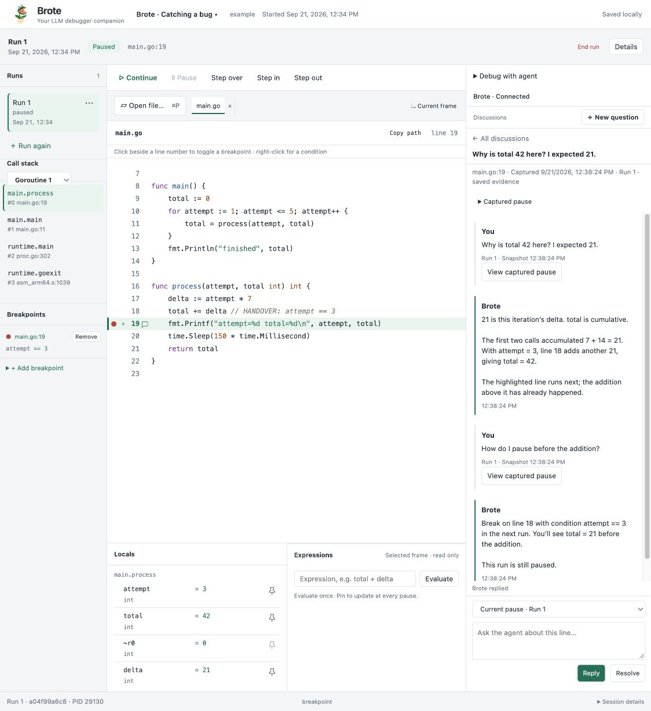

<p align="center">
  
</p>
<h1 align="center">Brote</h1>
<p align="center"><strong>Your LLM debugger companion.</strong></p>
<p align="center">Pause the program. Ask beside the code. Figure it out together.</p>

Brote is a shared Go debugger for humans and agents. The CLI owns sessions,
breakpoints, tracepoints, bounded inspection, and OTLP export. VS Code connects to
the same paused process for stepping, inline questions, and Chat.



*The earlier browser inspector illustrates the workflow; VS Code uses native comments and Chat.*

## Install and start

```sh
curl -fsSL https://github.com/javiermolinar/Brote/releases/latest/download/install.sh | sh -s -- --editor vscode
```

The shared-service changes described here are in development. Build this checkout
with `make vsix` to try them before a release. The platform VSIX includes the Brote
CLI; Go and Delve must also be installed. VS Code 1.138 or later is required.

```sh
go build -gcflags='all=-N -l' -o /tmp/demo .
brote start --binary /tmp/demo
# Use the returned session ID:
brote tracepoint add SESSION --file /absolute/path/main.go --line 12 \
  --name work.result --values '{"total":"total"}'
```

Run **Brote: Attach to Session** in VS Code, or choose **Brote: Go program** and
press F5 to build and launch through the same service. Ordinary breakpoints and tracepoints
share one service. Add tracepoints from the editor context menu or the CLI; both
show the same definitions. Successful exclusive tracepoint hits capture and
continue. Ordinary breakpoints, manual pauses, uncertain hits, and capture failures
remain paused. Select a source line and choose **Ask Brote About Selection** for a
conversation using bounded service evidence. A model provider is needed for answers.

Set `OTEL_EXPORTER_OTLP_ENDPOINT` in the launching CLI environment for automatic
OTLP/HTTP export, including sessions with no editor attached. Capture status and
export status are separate. [Tracing setup](docs/tracing.md) explains the limits.

```text
Humans / agents ── Brote CLI ──────────────┐
VS Code ────────── Brote CLI (DAP / JSON) ─┤
                                         ▼
                                 Brote session service
                                   │              │
                                  Delve          OTLP
                                   │              │
                               Go program    Tempo / Grafana
```

[VS Code guide](packages/vscode/README.md) · [Shared service contract](docs/shared-service.md)
· [CLI debugging guide](docs/debugging.md)

## Development

```sh
npm ci
make build
make test
make vsix
```

MIT licensed. Third-party notices are retained.
