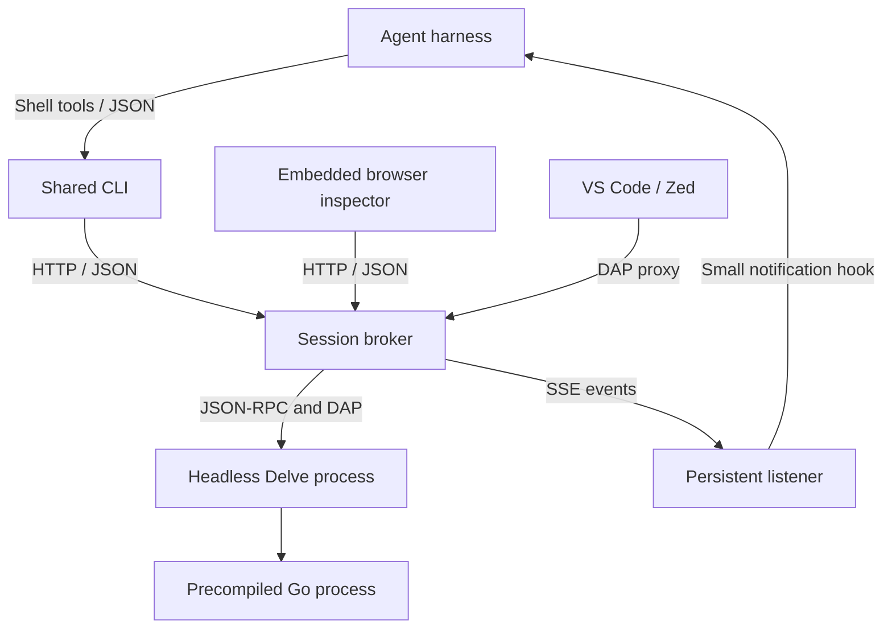

# Architecture

The broker owns debugger operations, pause/ownership invariants, stale-action checks,
persisted events, source provenance, and recovery. Each session has one broker and
one independently running Delve. Neither the CLI, inspector, nor harness is the
lifetime owner of the target. The only deliberate target termination is `stop`.

CLI commands use the local HTTP/JSON contract. Long-lived `events` connections use
SSE; `await-control` is a bounded client of that stream. Browser refresh currently
polls snapshots for source/locals rendering; notification delivery does not poll
state. Editor DAP requests pass through the ownership proxy.

Agent binding IDs and revisions coordinate routing without encoding harness details.
The core imports no Codex/Pi code. Codex's detached bridge stores conversation routing
separately and calls `codex queue`; Pi's extension consumes the CLI JSONL stream and
uses its native follow-up message API. Pi's only special tool is `debug_connect`,
which establishes that notification binding. All debugger operations remain CLI.

Receiving a handback event is not permission to resume. A listener verifies current
owner, event and binding revision before sending. The agent checks again, reads fresh
stack/locals, and acknowledges. Delivery can be pending, sending, queued, failed,
unknown, or acknowledged. A crash during sending is never blindly retried.

## Package boundaries

- `internal/broker`: state machine, local API, event journal/SSE, DAP proxy, inspection.
- `internal/session`: persisted descriptors, bindings, events, atomic files, fingerprinting.
- `internal/cli`: JSON commands, SSE clients, process launch/recovery, Codex bridge, setup.
- `internal/agents/codex`: Codex executable capability discovery and queue invocation.
- `internal/delve`, `internal/dap`: protocol clients and framing.
- `ui/inspector`: TypeScript sources and committed assets embedded in the Go executable.
- `adapters/pi`: small Pi conversation binding and notification extension.
- `editors/vscode`, `internal/editors/zed`: optional editor attachment.

## Installation

GitHub's shell bootstrap downloads a release bundle and verifies its checksum, then
runs the bundled executable's `setup`. Setup owns platform/harness registration and
repair. Versioned release directories sit behind a stable `current` link. Existing
processes keep their running binary during upgrades. Codex uses an installation-owned
marketplace; Pi references a stable local package. Both include the browser inspector.

No MCP, gRPC, remote debugger service, or Windows support is included in v1.
See [protocol.md](protocol.md) for the extension contract and its limitations.
