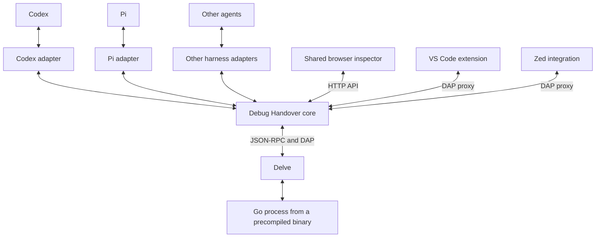

# Architecture

The goal is one persistent debugger session that an agent and a human can pass back and forth. Starting a session uses an existing Go executable or test binary; a handover preserves the process, memory, breakpoints, and stopped location.

## Proposed cross-agent structure

- **Core:** manages sessions, debugger operations, ownership, stale-action checks, persisted state, handover events, and recovery.
- **Harness adapter:** exposes tools to its agent, binds the correct conversation, opens the shared inspector, and delivers handover events. Each harness can add a small native widget without duplicating the debugger UI.
- **Shared inspector:** displays source, stack, goroutines, locals, watches, breakpoints, and ownership. The proposed adapter contract supplies the agent's display name and return destination.
- **Editor integration:** attaches to the same Delve process through the broker and supports returning control to the agent. VS Code has a companion extension; Zed currently uses a generated profile and Codex desktop automation to select it.

Observers may inspect the session, but only the current owner may control execution. Handover requires a settled pause. An event returning control to an agent must be checked against current ownership and its destination before the agent reads fresh state. Waking a conversation does not authorize resuming the target.

## Implemented today

The Go broker has a standalone JSON CLI, an authenticated local HTTP API, a Delve JSON-RPC client, and a DAP ownership proxy. The TypeScript browser inspector and VS Code companion share that session. Codex handback delivery uses `codex queue --thread`; Zed attachment uses a generated debug profile.

The code has separate packages for CLI commands, the broker, session storage, protocol transports, and integrations. Codex delivery has been extracted, but the session schema and owner labels still name Codex. The diagram describes the intended cross-agent contract; Pi and an MCP server are not implemented.

| Component | Current source |
| --- | --- |
| Executable and commands | `cmd/debug-handover/`, `internal/cli/` |
| HTTP API, ownership, inspection, event bookkeeping | `internal/broker/` |
| Session descriptors, persistence, binary provenance | `internal/session/` |
| Delve JSON-RPC and exit-state decoding | `internal/delve/` |
| DAP framing / ownership proxy | `internal/dap/`, `internal/broker/dap.go` |
| Codex delivery and skill | `internal/agents/codex/`, `skills/debug-handover/` |
| Browser inspector | `ui/inspector/` |
| Optional VS Code companion | `editors/vscode/` |
| Editor identities and Zed profiles | `internal/editors/` |

## Package boundaries

- The executable calls `internal/cli`. The CLI parses arguments, manages broker child processes, and calls the broker's HTTP API.
- The broker starts through `broker.Serve(broker.Options)`. It owns execution state, locking, action generations, inspection, event persistence, and frontend connections. Its state is private to the package.
- `internal/session` stores shared data and provides filesystem and binary-provenance operations. It imports no broker, CLI, editor, or harness code.
- `internal/delve` and `internal/dap` contain transport behavior without ownership or application state.
- `internal/agents/codex` owns CLI discovery, message wording, and queue invocation. The broker retains delivery status and duplicate/stale-event handling.
- Zed configuration lives outside the broker. The VS Code extension is a separate TypeScript application; the core has no build or runtime dependency on it.
- `ui/inspector` embeds the committed browser assets in the Go executable. TypeScript sources and preview tooling live alongside those assets and are excluded from the embedded filesystem.

Unit tests live beside their components. The CLI integration test builds temporary targets and exercises the real HTTP / DAP / Delve round trip, including crash recovery. Session JSON fields, API routes, CLI commands, and ownership semantics remain compatible with the original prototype.

## Next boundary to extract

Replace the fixed Codex identity and destination with a harness binding, and keep durable handover events in the core. The Codex adapter would preserve the current queue behavior. A Pi adapter could register debugging tools, open the same inspector, and deliver handbacks to the matching Pi session. Recovery must account for an agent being offline, conversation switching or forking, and stale or duplicate events.

## Installation model

Separate packages should not require users to coordinate separate setup procedures. The intended installer installs one shared core, registers the selected agent adapter, and optionally installs the VS Code companion. Both agents and editors connect to that core. The browser inspector ships with the core and needs no separate extension.

This unified installer is not implemented yet. The prototype still installs its Codex plugin and optional VSIX separately. For now, the plugin bundles the core source and browser assets; the launcher builds a cached helper. The VSIX is packaged independently and can optionally be included in the plugin archive. Keeping that build boundary separate does not imply that the finished product should expose two manual installation flows.

The repository is named `delve-llm-adapter`. Existing `debug-handover` plugin, CLI, extension, and session identifiers remain stable during this extraction.
