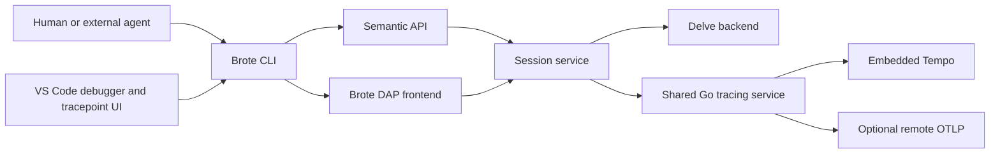

# Shared Brote service

Brote owns debugging sessions. Humans and agents use the CLI; VS Code uses
Brote's DAP frontend and semantic API. Neither client creates a second Delve
controller. The existing process-per-session broker remains the service runtime;
a global daemon is not required.



## Contract and migration

The existing descriptor and CLI protocol v2 remain readable. Shared-service API
version 1 is the default contract for new starts, defined in internal/protocol.
Defining its types does not advertise that all planned operations are available.
Unsupported API versions fail explicitly; an absent service version identifies a
legacy session. Legacy records must never be silently upgraded into capabilities
their running broker does not implement.

Each response identifies the session and run. A session is a service-owned
debugging lifetime, not a goroutine. Restart preserves session identity but
creates a new run; a fresh start creates both. Generation fences commands across
state transitions; pauseEpoch invalidates frame and variable handles after
movement. Goroutine IDs are meaningful only within a run. Frame/variable handles
are meaningful only within their run and pause epoch. Client IDs identify
configuration ownership; agent bindings and leases identify execution scope.
Neither is an authentication credential.

Requests carry version, session, run, client, commandId, operation and generation.
Identity and capability checks precede dispatch. A stale generation is rejected,
except for a direct human pause on the same session/run. Command IDs correlate
accepted dispatch, asynchronous stops and failures; accepted dispatch is not
proof of reaching a stop. Retry handling must not redispatch an ambiguous command.

Stable error codes include incompatible_protocol, identity_mismatch,
unsupported_operation, invalid_request and stale_revision. Clients refresh or
rediscover on stale identities; they must not retry execution blindly.

## Operations

The service contract covers these semantic operation families. Session capability
responses must advertise only implemented operations supported by that backend.

| Family | Operations and meaning |
| --- | --- |
| Lifecycle | Start executable or selected test, attach local process, discover, restart, detach, terminate. Editor disconnect closes the frontend only. |
| Inspection | State, goroutines, bounded stacks/scopes/variables, read-only expressions, panic/exception evidence. |
| Execution | Continue, next, step, step-out, pause under one coordinator. Human interruption cancels pending agent execution. |
| Definitions | List/create/update/remove source or function breakpoints and source-line tracepoints using stable Brote IDs and revision checks. |
| Evidence | Bounded captures, capture outcomes, program/debugger trace IDs, cursor-based events. |

Definitions carry workspace/session/run scope, owner, revision, requested
location, enabled state, condition and hit condition. Tracepoints additionally
carry capture name, selected values and per-run capture limit. Hit conditions
control adapter triggering; capture limits bound observations. Adapter IDs,
verification and relocated locations are ephemeral per-run data, never the
definition identity. Reconnecting editors replace only their owned sets.

Captures identify the session/run/epoch, definition, sequence and goroutine.
Captured, skipped, truncated and failed outcomes are distinct. Export status is
separate: disabled, queued or failed does not claim successful Tempo retrieval.
Capture failure, uncertain attribution, exhausted limits or human interruption
must leave the target paused. Snapshot span timing is not function duration.

DAP capability negotiation takes an allowlist intersection with Delve. Arbitrary
forwarding, mutation, injected function calls, reverse debugging, memory and
disassembly are outside this milestone. DAP evaluation uses the same read-only
expression validation as CLI inspection.

## Local transport

The registry stores credentials in owner-only records. HTTP and event endpoints
require the session credential and validate local endpoint, Host and Origin.
Binding identity never substitutes for authentication. DAP admission must use a
credential-bearing Brote transport or equivalent owner-only local channel before
accepting editor commands. Public state, errors and trace attributes omit tokens
and OTLP headers. Session discovery checks identity without attaching, resuming
or recovering a target.

## Delivery sequence

First ship CLI-managed sessions with optional VS Code attachment and service-owned
trace export. Then add explicit Brote F5 source/executable/test configurations,
installing initial breakpoints before execution. Ordinary native Go launch profiles
continue to work. During migration, only one capture/continuation/export owner is
active for any Brote session.

The implementation uses common Go contract types, request-envelope validation,
and restricted shared DAP capabilities/requests. The default shared-service launch mode adds service/run identity, authenticated HTTP
and DAP admission, and a health-only discovery probe. Use brote dap SESSION as an
editor stdio transport; credentials remain in the private registry. Existing
legacy sessions retain their contract. Use --legacy or --service=false for an
explicit legacy launch; run-again preserves the saved mode.
Authenticated browser event streams use fetch with bearer headers, never cookies
or credential query parameters. Direct Zed TCP handover is unavailable for this
shared mode. Local process attach is available with --pid PID --binary PATH. Source/test
configurations accept substitutePath mappings; they are applied by the shared
Delve connection and preserved on recovery/restart. Brote does not rebuild on
restart. Use brote restart SESSION --human for a launched target, or
brote detach SESSION --human to release an externally attached target without
killing it. Detach is rejected for Brote-launched targets because Delve cannot
preserve them through its detach operation; editor disconnect keeps their service
alive, and explicit termination ends them. Externally
attached targets cannot be restarted by Brote. Restart preserves the broker/session,
creates a new run and PID, restores breakpoint sets and disconnects the old editor
frontend. Reattach through brote dap SESSION.
Definitions, bounded capture/continuation, CLI operations, service export and the
VS Code attach/tracepoint UI and explicit Brote F5 source/test/exec launches are
implemented. F5 installs tracepoints and ordinary breakpoints before
configurationDone; no movement is accepted earlier. Editor restart retains the
connection and repeats configuration for the new run; CLI restart disconnects it.
Explicit DAP terminate ends the target, while disconnect alone retains it.
Unconfigured F5 startups expire after 30 seconds.

Run python3 scripts/check-shared-service.py for an isolated real Delve check of
authenticated discovery, editor attach/disconnect, restart, process attach/detach,
selected test execution, source mapping, breakpoint restoration, reliable Pause,
session isolation, receiver failure, CLI captures and limits.

## Current service behavior

Service execution replies distinguish accepted dispatch from the later stop. Pause
can interrupt a pending Delve continue/step reply. Human movement cancels an agent
scope; if the previous movement is still pending, refresh the resulting pause and
issue the human movement again. Movement command IDs are required and retained
across broker recovery (maximum 4096 per run); duplicates are rejected. Pause stays
available when that history is full. Agent continuation requires a current binding
and unexpired execution task.

Inspection releases the execution mutex while reading Delve. A changed run or pause
epoch invalidates the result. Expansion has a two-second aggregate deadline,
128-value and 32 KiB value budgets, with explicit errors and truncation. DAP stack
and variable pages are limited to 128 entries. Panic stops retain exception details.

The authenticated `/api/v1` endpoint supports versioned `definition.list`,
`definition.put`, `definition.delete` and `capture.list` operations. Definitions
have stable IDs, owner and revision checks, and explicit workspace/session scope;
optional run scope expires on restart. At most 512 definitions are stored. Function
tracepoints are unsupported. Source tracepoints share adapter points when their
location and conditions match, while retaining separate logical ownership. An
ordinary breakpoint sharing that point preserves the stop.

An exclusive, verified tracepoint hit captures its goroutine with a two-second
aggregate deadline and a 128 KiB record limit. Capture history retains the newest
64 records; per-run hit counts survive broker recovery. Outcomes distinguish
captured, skipped, truncated and failed. Automatic continuation requires a complete
capture, unchanged execution intent/configuration/epoch, and valid execution scope.
Human Pause, a step, uncertain attribution or exhausted limits leaves it paused.

Shared sessions send bounded Go-generated span batches to the shared tracing
service, which embeds Tempo and owns optional remote OTLP export. Local capture
requires no OTLP environment. Remote settings and credentials are read only by the
tracing service at startup; restart that service after changing them. Invalid or
unavailable remote export remains visible without disabling local ingestion.

Each execution run has separate program/debugger trace IDs and a `session:run`
trace record. The broker retains capture IDs, selected scalar values and per-run
limits; native VS Code tracing explicitly excludes Brote sessions. Restart creates
new trace IDs; recovery preserves saved IDs. `brote traces` lists destination status,
and `brote trace TRACE_ID` queries embedded Tempo after block flushing and polling.
Export acceptance is distinct from query availability and crash durability.
See [embedded Tempo](embedded-tempo.md) for the local API and storage boundaries.

The broker's producer queue is bounded to 256 spans and batches to 64. The tracing
service owns independent bounded local/remote queues. Human pause and capture
failure behavior is unchanged. The following check uses an optional external Tempo
receiver; the core tracing integration also verifies embedded local storage.

Run the real receiver check with:

```sh
BROTE_CHECK_OTLP=1 OTEL_EXPORTER_OTLP_ENDPOINT=http://127.0.0.1:4318 \
  python3 scripts/check-shared-service.py
```

This retrieves both trace IDs from local Tempo, checks observation parentage and
verifies the selected scalar value. CLI and VS Code share these definitions and
exporter; the extension contains no separate capture/continuation/export controller.
